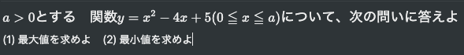

import { Link } from 'gatsby'
import { FiInfo } from 'react-icons/fi'
import { LikeButton } from '../../components/Complete'

<h3>問題へのアプローチの仕方</h3>

<FiInfo className="nice-text-icon"></FiInfo>

グラフをかいて考えるとよい。
与えられた関数のグラフは下に凸で、軸は直線 x=2 である。
定義域は a の値が大きくなるにつれて拡大していくので、
それに伴い定義域の左右のどちらの端点が軸から遠くなるか考えて a について場合分けをする。
そのとき、両端点と軸からの距離が等しい時、
つまり、定義域の中央と軸が一致するときに着目する

<LikeButton />

<Link to="/posts" className="btn center-btn">
  all posts
</Link>
